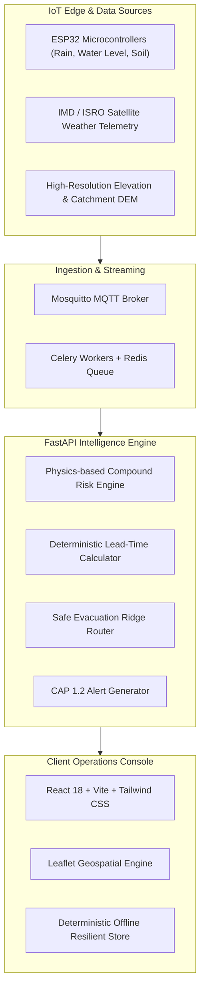

# PRALAY (प्रलय): Hyper-Local Flash Flood Early Warning & Disaster Decision Support System 🌊

[](https://sih.gov.in)
[](https://sih.gov.in)
[](https://smart-india-hackathon-2026-git-main-sanjivani-university.vercel.app)
[](https://react.dev)
[](https://fastapi.tiangolo.com)
[](LICENSE)

> **PRALAYADARSHI** (Sanskrit: *प्रलय* - Deluge + *दर्शी* - Foresight) is a comprehensive, production-grade compound disaster early warning and evacuation decision support platform engineered specifically for fragile Himalayan and hilly river catchments (Chamoli, Rudraprayag, and Uttarakhand valley systems).

---

## 🌐 Live Web Demo
🔗 **Production URL on Vercel**: [https://smart-india-hackathon-2026-git-main-sanjivani-university.vercel.app](https://smart-india-hackathon-2026-git-main-sanjivani-university.vercel.app)

---

## 🎯 Problem Statement (SIH 2026 — ID: 26192)

Hilly and river-basin regions in India experience extreme flash floods and cloudburst events characterized by rapid onset and steep catchment response curves. Conventional regional alerts lack village/ward-level granularity, actionable lead-time estimation, and clear evacuation guidance, leading to preventable casualties during extreme hydro-meteorological events.

**PRALAY resolves this by coupling:**
1. **IoT Edge Telemetry** (Tipping-bucket rain gauges, ultrasonic river radars, 3-depth TDR soil moisture probes, MEMS inclinometers).
2. **Deterministic Physics + ML Risk Engine** (Catchment concentration modeling, antecedent precipitation index, soil saturation pore-pressure curves, LSTM runoff prediction + XGBoost compound classification).
3. **Actionable Emergency Operations** (Lead-time calculation, safe elevation evacuation corridors, shelter capacity allocation, and CAP 1.2 multi-channel citizen dissemination).

---

## 🧭 The 4 North Star Decision Panes (PRD §1 & §12)

Every screen and alert in PRALAY is anchored to 4 real-time, non-negotiable operational decision outputs:

```text
┌──────────────────────────────────────────────────────────────────────────────┐
│                        4 NORTH STAR DECISION PANES                           │
├──────────────────────┬──────────────────────┬────────────────────────────────┤
│ 1. COMPOUND RISK     │ 2. ESTIMATED LEAD    │ 3. EVACUATION PATHWAY          │
│    LEVEL & SEVERITY  │    TIME TO CREST     │    & SAFE SHELTER              │
│    (Flood + Slide)   │    (e.g., 35 Mins)   │    (Safe Ridge Bypass)         │
├──────────────────────┴──────────────────────┴────────────────────────────────┤
│ 4. BILINGUAL CITIZEN EMERGENCY WARNING CARD (PRD §18)                        │
│    (Plain-language, actionable instructions without technical jargon)        │
└──────────────────────────────────────────────────────────────────────────────┘
```

---

## 📱 Modules & Application Pages

| Module | Route | Key Capabilities |
|---|---|---|
| **Executive Decision Dashboard** | `/` | 4 North Star decision panes, interactive PRD §23 12-step scenario simulation player, pilot village selector, citizen alert modal. |
| **Geospatial Risk & Evacuation Map** | `/map` | High-performance Leaflet GIS view, village risk status badges, relief shelters with capacity metrics, and multi-hazard avoidance routes. |
| **IoT Edge Telemetry Monitor** | `/sensors` | Real-time MQTT/HTTP ingestion metrics from field rain gauges, ultrasonic river gauges, TDR soil sensors, and battery health. |
| **Disaster Alert & Dispatch** | `/alerts` | CAP 1.2 multi-channel alert gateway (NDRF siren, SMS cell broadcast, IVR call tree, and district control room bulletins). |
| **Pilot Catchments & Demographics** | `/regions` | Detailed vulnerability profiles for priority villages (Raini, Tharali, Joshimath, Sonprayag, Ukhimath). |

---

## ⚡ PRD §23 End-to-End 12-Step Demonstration Scenario

PRALAY includes a deterministic simulation engine tracking disaster progression in **Raini Village (Chamoli)** across 12 sequential phases:


---

## 🏗️ Architecture & Technical Stack



- **Frontend**: React 18, TypeScript, Vite, Tailwind CSS, Lucide Icons, Leaflet GIS, Zustand state management.
- **Backend**: FastAPI (Python 3.11+), Pydantic v2, NumPy, SciPy, Uvicorn.
- **Resilience**: Zero-crash React Error Boundary, client-side deterministic offline simulation data, and SPA routing rewrites for Vercel.

---

## 🚀 Deployment Guide (Vercel)

The repository includes pre-tested configuration files for both root repository deployment and monorepo subdirectory deployment.

### Option A: Automatic Root Deployment (Default)
1. Import `https://github.com/dakrkakashi/smart-india-hackathon-2026.git` into [Vercel](https://vercel.com).
2. Vercel automatically detects [`vercel.json`](file:///vercel.json) at root:
   - **Framework Preset**: Vite
   - **Build Command**: `(cd pralay/frontend 2>/dev/null || true) && npm install && npm run build`
   - **Output Directory**: `pralay/frontend/dist`
3. Click **Deploy**.

### Option B: Root Directory Override
1. In Vercel Project Settings &rarr; **General** &rarr; **Root Directory**, set:
   ```
   pralay/frontend
   ```
2. Build Command: `npm run build`
3. Output Directory: `dist`
4. Click **Save** and trigger a redeploy.

> [!NOTE]
> **Vercel Deployment Protection**: To allow judges and evaluators to access the deployment without logging into Vercel, disable **Vercel Authentication** under Project Settings &rarr; **Deployment Protection**.

---

## 💻 Local Development Setup

### 1. Frontend Setup
```bash
cd pralay/frontend
npm install
npm run dev
```
Navigate to `http://localhost:5173` to explore the interactive dashboard and map.

### 2. Backend Setup
```bash
cd pralay/backend
python -m venv venv

# Windows:
.\venv\Scripts\activate
# Linux/macOS:
source venv/bin/activate

pip install -r requirements.txt
python -m uvicorn app.main:app --reload --port 8000
```
Interactive Swagger API documentation: `http://localhost:8000/docs`.

### 3. Docker Compose Orchestration
```bash
cd pralay
cp .env.example .env
docker-compose up --build -d
```

---

## 🧪 Verification & Automated Testing

The complete system has been verified through end-to-end automated pipelines:

- **Backend Pytest Suite**: `14/14 passed (100%)`
  - `test_predictions_endpoint` ✅
  - `test_dashboard_summary` ✅
  - `test_risk_engine_flood_calculation` ✅
  - `test_lead_time_engine` ✅
  - `test_evacuation_routing` ✅
  - `test_12_step_demo_scenario` ✅
  - `test_sensor_ingestion_validation` ✅
  - `test_citizen_alert_card` ✅
- **Frontend Type Safety**: `npx tsc --noEmit` &rarr; `0 errors`
- **Frontend Linter**: `npm run lint` &rarr; `0 errors, 0 warnings`
- **Production Build**: `npm run build` &rarr; `dist/` verified cleanly in 4.01s

---

## 📂 Repository Artifacts

- 📑 [`PRALAY_SIH_2026_Presentation.pptx`](file:///PRALAY_SIH_2026_Presentation.pptx): Official 6-slide SIH presentation deck.
- 📑 [`PRALAY_SIH_2026_Presentation.pdf`](file:///PRALAY_SIH_2026_Presentation.pdf): Printable/portable slide deck for evaluation.
- 📁 [`plans/`](file:///plans/): Engineering roadmaps, verification protocols, and PRD specifications.
- 📁 [`pralay/`](file:///pralay/): Full-stack application source (backend, frontend, iot, ml, data).

---

## 👥 Team & Acknowledgments

- **Hackathon**: Smart India Hackathon (SIH) 2026
- **Problem Statement ID**: 26192
- **License**: [MIT License](LICENSE)
